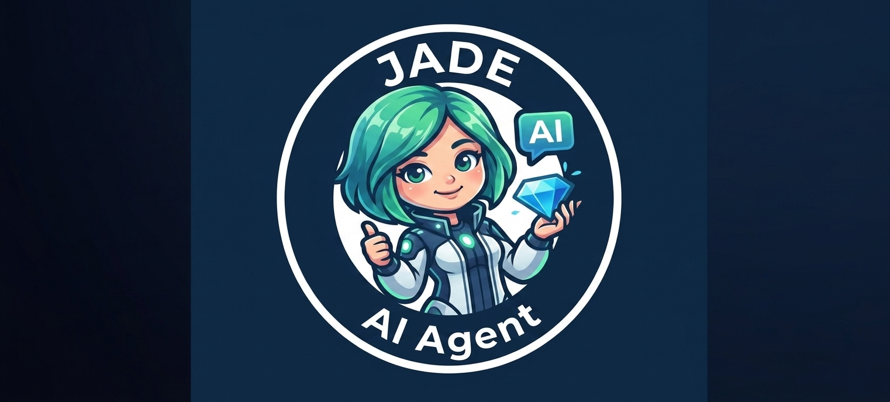

<p align="center">
  
</p>

<h1 align="center">💎 JADE AI Agent</h1>

<p align="center">
  <strong>Assistente Virtual Inteligente para Código, Automação e Produtividade</strong>
</p>

<p align="center">
  
  
  
</p>

---

---

**Aplicação Online:** [Acessar a JADE no Render]https://jade-ai-agent-1-scuv.onrender.com

Assistente Virtual Inteligente baseada em Inteligência Artificial, construída com arquitetura RAG (Retrieval-Augmented Generation), LangChain Expression Language (LCEL) e implantada de forma leve no Render.com.

---

## 📝 1. Descrição Geral do Projeto

A **JADE AI Agent** é uma assistente virtual conversacional projetada para responder a dúvidas de usuários de forma clara, contextualizada e amigável. O projeto combina o poder do modelo **Llama openai/gpt-oss-120b** via API da **Groq** com busca vetorial de documentos em tempo real.

O projeto foi totalmente otimizado para execução contínua em ambientes de recursos reduzidos (como a camada gratuita do Render.com com limite de **512 MB de RAM**), garantindo inicialização rápida, baixa pegada de memória e respostas em tempo real.

---

## 🏗️ 2. Arquitetura da Solução

A arquitetura da JADE utiliza uma abordagem moderna focada em eficiência e performance:

* **Interface Web (Gradio):** Recebe as perguntas do usuário e exibe as respostas do chat em tempo real.
* **LangChain LCEL (Pipeline):** Orquestra o fluxo entre o modelo de linguagem e o banco de dados de forma declarativa.
* **Groq API (Llama-openai/gpt-oss-120b"):** Executa o processamento do LLM em nuvem com alta velocidade.
* **Chroma DB + FastEmbed (RAG):** Armazena os documentos vetoriais e realiza buscas de similaridade utilizando uma biblioteca de embeddings leve otimizada para C++.

### Principais Decisões Arquiteturais:
* **Pipeline RAG via LCEL (LangChain Expression Language):** Garante código limpo, declarativo e compatível com as versões mais recentes do LangChain.
* **Lazy Loading do Banco Vetorial:** O carregamento dos embeddings e da base vetorial ocorre apenas sob demanda na primeira pergunta do usuário, garantindo a abertura rápida da porta HTTP (`PORT 10000`).
* **Embeddings Ultraleves (FastEmbed):** Substituição de bibliotecas nativas em PyTorch por execução otimizada em ONNX C++, reduzindo o consumo de RAM de mais de 500MB para apenas ~80MB.

---

## 🛠️ 3. Tecnologias e Ferramentas Utilizadas

| Categoria | Tecnologia / Biblioteca | Descrição |
| :--- | :--- | :--- |
| **Linguagem** | Python 3.10+ | Linguagem base do projeto |
| **Interface Web** | Gradio | Interface de chat interativa e elegante |
| **Orquestração AI** | LangChain / LangChain Core | Framework para encadeamento do RAG e prompts |
| **LLM (Modelo)** | Groq API (`llama-openai/gpt-oss-120b"`) | Processamento de linguagem natural de alta velocidade |
| **Embeddings** | FastEmbed (`BAAI/bge-small-en-v1.5`) | Gerador de vetores leve e de baixa memória |
| **Banco Vetorial** | ChromaDB | Armazenamento e busca por similaridade de documentos |
| **Hospedagem** | Render.com | Nuvem para deploy do serviço web 24/7 |

--
Demonstração de funcionalidades
-
<p align="center">
  
  
</p>


### 💡 Exemplos de Perguntas para a JADE

#### 💻 Programação e Desenvolvimento
- *"Como criar uma função em Python para conectar a uma API REST com autenticação?"*
- *"Explique a diferença entre `let`, `const` e `var` em JavaScript com exemplos práticos."*
- *"Como tratar erros e exceções em uma aplicação Flask de forma limpa?"*

#### 📝 Redação e Criação de Conteúdo
- *"Escreva um e-mail profissional solicitando feedback sobre a entrega de um projeto."*
- *"Crie um resumo explicativo sobre arquitetura de microserviços para iniciantes."*
- *"Ajude-me a revisar e melhorar o tom deste texto."*

#### 🧠 Lógica e Resolução de Problemas
- *"Como estruturar um banco de dados relacional para um sistema de e-commerce?"*
- *"Quais são as melhores práticas para otimizar consultas SQL lentas?"*

#### ⚡ Produtividade e Planejamento
- *"Monte um checklist com os passos essenciais para fazer o deploy de uma aplicação no Render."*
- *"Quais ideias de novas funcionalidades posso implementar em um assistente virtual?"*

## 🚀 4. Instruções para Executar o Projeto

### 💻 Execução Local

1. **Clone o repositório e acesse a pasta:**
   ```bash
   git clone [https://github.com/Laisallz/jade_ai_agent.git](https://github.com/Laisallz/jade_ai_agent.git)
   cd jade_ai_agent
